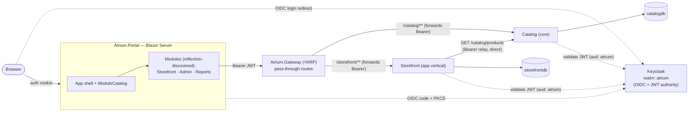

# Atrium — architecture reference

The consolidated "how it fits together" doc. For the build history and how to run, see
[HANDOFF.md](HANDOFF.md); for *why* each choice was made, see the [ADRs](adr/); for what was
deliberately scoped out, see [BEYOND-THE-DEMO.md](BEYOND-THE-DEMO.md); for the flows drawn out (auth,
checkout, module discovery) see the [Mermaid diagrams](diagrams/).

## One-paragraph summary

Atrium is a **modular-monolith Blazor Server portal**. A single host shell (`Atrium.Portal`)
discovers self-contained UI **modules** by reflection through an `IModule` contract — the host
references the modules but names none of them. Behind the UI, a **YARP gateway** fronts a set of
backend services split along the Self-Contained-Systems grain: a **core service** owns a capability's
data (Catalog owns products), and an **app vertical** owns its own database and composes core services
for everything else (Storefront owns orders, calls Catalog to price them). Identity is **Keycloak**
(OIDC for the Portal, JWT bearer for the services). Data access is **Dapper + stored procedures +
DbUp + Mapperly** — no EF. Cross-host infrastructure (telemetry, JWT auth, api docs, the DbUp runner)
lives once in **`Atrium.ServiceDefaults`** (ADR-0012). An AI **Support agent** (Microsoft Agent
Framework over Ollama) ships inside the Storefront vertical and surfaces in the shell as a chat
launcher. The whole thing is orchestrated for local dev by a single-file **Aspire** AppHost.

## Topology

The **cookie** hop is Browser ↔ Portal only; every hop from the Portal's typed clients onward carries
a **Bearer JWT**. The gateway does no auth of its own — it forwards the token to the target service,
which validates it. The Storefront→Catalog price-relay call goes **direct** to the Catalog service
(`https+http://catalog`), not back through the gateway.

- **Ingress is the gateway.** The Portal only knows the gateway address (`https+http://gateway` via
  Aspire service discovery); it never addresses Catalog or Storefront directly. YARP matches
  `/catalog/{**catch-all}` and `/storefront/{**catch-all}` to the two clusters
  (`src/Atrium.Gateway/appsettings.json`).
- **Two service shapes.** *Core* (Catalog) = owns a domain's data, no cross-service calls. *App
  vertical* (Storefront) = owns its own DB **and** composes core services. See
  [ADR-0005](adr/0005-slice-calls-core.md).
- **One database per service.** `catalogdb` and `storefrontdb` are separate databases on the shared
  SQL Server instance — no cross-database joins; Storefront gets product data over HTTP, not SQL.
- **The AI agent rides the same rails.** The Support agent's AG-UI SSE endpoint
  (`POST /storefront/agent`) and feedback endpoint (`POST /storefront/agent/feedback`) are ordinary
  Storefront routes behind the gateway's `/storefront/**` catch-all — same bearer, same validation,
  plus a step-up MFA policy on the agent route.

## Solution layout (`src/`)

| Project | Role |
|---|---|
| `Atrium.Portal` | Blazor Server host: module discovery, app shell, OIDC login, token capture, assistant launcher. |
| `Atrium.Abstractions` | The `IModule` + `NavItem` + `AgentSurface` contract. The *only* thing the host and modules share by type. |
| `Atrium.Design` | Design-system RCL: `tokens.css` + `atrium.css`, primitives (Button/Badge/Dialog/Field/Menu/Notice/PageHeader/ToastHost/AgentChat), `AccessTokenHolder`, `Money`, the shared typed-client send pipeline (`HttpClientExtensions`), and the AG-UI chat plumbing (`AgentChatClientFactory`/`BearerTokenHandler`/`FeedbackClient`). |
| `Atrium.Contracts` | DTOs crossing the wire (Product/Category/Order/Report/Feedback). |
| `Atrium.ServiceDefaults` | Shared deployment infrastructure: `AddAtriumTelemetry`, `AddAtriumJwtAuth`, `MapAtriumApiDocs`, the two-lane `DatabaseInitializer`. Never domain code (ADR-0012). |
| `Atrium.Modules.Storefront` | Storefront UI module — Shop, Cart, Orders; contributes the Support `AgentSurface`. Amber accent. |
| `Atrium.Modules.Admin` | Back-office products table, inline edit + create. Indigo accent. Writes are admin-gated server-side. |
| `Atrium.Modules.Reports` | Sales analytics — stat cards + CSS bar chart. Violet accent. Admin-gated. |
| `Atrium.Services.Catalog` | **Core** service: products via Dapper/sprocs/DbUp/Mapperly, JWT-secured. |
| `Atrium.Services.Storefront` | **App vertical**: own DB (orders + reports), calls Catalog, JWT-secured; hosts the AI Support agent (`Support/`). |
| `Atrium.Gateway` | YARP reverse proxy + Aspire service discovery. |
| `Atrium.AppHost` | Single-file Aspire (`apphost.cs`), run with `aspire run`; points the agent at host-local Ollama via `SupportAgent__*` env vars. |

The host references every `Atrium.Modules.*` project but hard-codes none of them; a new module is a
project reference plus one `IModule` implementation. See [ADR-0001](adr/0001-modular-monolith.md).

## Request flow (an authenticated read)

1. Browser hits a module page (`/storefront`). The Portal is a confidential OIDC client; unauthenticated
   requests redirect to Keycloak, come back with an auth cookie.
2. `MainLayout` copies the access token out of the `ClaimsPrincipal` (where OIDC parked it) into a
   **scoped** `AccessTokenHolder`. See [ADR-0004](adr/0004-token-propagation-and-option-b.md).
3. A typed client (`CatalogClient` / `OrdersClient` / `ReportsClient`) reads the holder, attaches
   `Authorization: Bearer …`, and calls the **gateway**.
4. YARP routes to the target service. The service validates the JWT (Keycloak issuer, shared `atrium`
   audience) and authorizes by policy (`admin` for writes).
5. For an app vertical composing a core (Storefront pricing / reports), the service **relays the
   caller's bearer** to Catalog via `IHttpContextAccessor` — valid here because a normal API request
   *has* an `HttpContext` (a Blazor circuit does not). See [ADR-0005](adr/0005-slice-calls-core.md).

## Data

Both services use the same recipe (see [ADR-0002](adr/0002-dapper-sprocs-dbup.md)):

- **DbUp, two lanes.** `Data/Scripts/Migrations/*` run **once** (schema + seed);
  `Data/Scripts/Programmability/*` run **always** as `CREATE OR ALTER` (stored procedures). SQL files
  are embedded resources in each service; the runner is the shared
  `Atrium.ServiceDefaults.DatabaseInitializer`, called at service startup with the service's own
  scripts assembly (ADR-0012).
- **Dapper** executes the sprocs; **Mapperly** maps rows → DTOs at compile time.
- **Catalog** (`catalogdb`): `usp_Product_GetList/Create/Update`, `usp_Category_GetList`.
- **Storefront** (`storefrontdb`): `usp_Order_Create/GetById/GetList`, `usp_OrderItem_Add`,
  `usp_Report_SalesByProduct`, `usp_Report_OrderCount`. Reports compose Catalog for the
  product→category map, then bucket sales by category.
- **Order creation is idempotent, per user.** `usp_Order_Create` dedupes the client's idempotency key
  scoped to the user, survives the concurrent double-submit race via TRY/CATCH on the unique index,
  and refuses another user's key (error 50002 → HTTP 409); the endpoint returns the **stored** order
  read back via `usp_Order_GetById`, never a re-priced reconstruction.

## Auth model

- **Portal → Keycloak: OIDC** (confidential client `atrium-portal`, secret injected by the AppHost as
  `Keycloak__PortalSecret`). **Checkout requires login; catalog browsing is anonymous.**
- **Services → Keycloak: JWT bearer.** Protected endpoints require a valid token with the shared `atrium`
  audience (a realm custom-audience mapper adds it). The authorization matrix:

  | Level | Endpoints |
  |---|---|
  | Anonymous | Catalog reads (`GET /catalog/products`, `/categories`) — the storefront browses signed-out |
  | Authenticated | Orders (`POST`/`GET /storefront/orders`), agent feedback |
  | `admin` policy | Catalog writes (`POST`/`PUT /catalog/products`) **and** Reports reads (`GET /storefront/reports/sales`) |
  | Step-up MFA policy | The agent endpoint (`POST /storefront/agent`) — requires an `amr`/`acr` step-up claim when enabled |

- **Roles are a flat `role` claim.** `MapInboundClaims = false` and `RoleClaimType = "role"` (so
  `RequireRole("admin")` matches) are set once for all services in `AddAtriumJwtAuth()`
  (`Atrium.ServiceDefaults`) — see [ADR-0003](adr/0003-yarp-keycloak-auth.md) and
  [ADR-0012](adr/0012-shared-deployment-infrastructure.md).

## AI support slice

The Support agent lives inside the Storefront vertical (`src/Atrium.Services.Storefront/Support/`),
not as a separate service — it needs the vertical's data (order lookups) and ships behind the same
gateway route. The shape:

- **Brain:** Microsoft Agent Framework `ChatClientAgent` over an `IChatClient` pipeline built in
  `SupportAgentBuilderExtensions` — **OTel (outermost) → guardrail → cache (innermost)**; the
  function-invocation loop sits above the pipeline. Provider is config-driven
  (`SupportAgent:Provider` = `Fake | Ollama | FoundryLocal | AzureFoundry`; Ollama is the real one,
  models pinned by the AppHost).
- **Guardrail:** a small classifier model screens **all** user-role messages in the transcript (the
  client resends history and threads are ephemeral, so screening only the last message is bypassable);
  classifier transport failure **fails closed** with the standard refusal; an unset
  `SupportAgent:GuardrailModel` logs a loud inert-guardrail warning.
- **Tools:** `SupportTools.GetOrderStatus` resolves orders through `usp_Order_GetById`, which filters
  on **both** order id and the authenticated user — the agent cannot read another user's order.
- **Surfaces:** a module contributes an `AgentSurface` (name + endpoint) via `IModule.AgentSurfaces`;
  the shell's `AssistantLauncher` renders the `AgentChat` primitive against it over AG-UI SSE.
  Endpoint: `POST /storefront/agent` (step-up MFA policy) · feedback: `POST /storefront/agent/feedback`
  (telemetry-only — an OTel span + structured log, no persistence).
- **Observability:** OTel GenAI spans (chat, tools, guardrail classifier) export to the Aspire
  dashboard via the shared telemetry defaults. Vendor-neutral OTLP — the same spans *would* export to
  Langfuse/App Insights by adding an exporter; none is wired.
- **Evals:** `tests/Atrium.Evals` scores the agent (relevance/groundedness/tool-call accuracy) with
  `Microsoft.Extensions.AI.Evaluation`, judged by a larger Ollama model; scenarios run only the
  evaluators that apply to them; the suite skips itself when Ollama or the required models are absent.

## Where the bodies are buried

The non-obvious mechanics, each with a home:

- **Module routing needs assemblies in two places** — `<Router AdditionalAssemblies>` *and*
  `MapRazorComponents().AddAdditionalAssemblies()`. → [ADR-0001](adr/0001-modular-monolith.md).
- **No *factory-registered* `DelegatingHandler` for the bearer token** — `IHttpClientFactory` resolves
  handlers in a separate scope, so the scoped holder reads empty. The AG-UI chat client's
  `BearerTokenHandler` is the one sanctioned exception: composed manually inside the circuit scope.
  → [ADR-0004](adr/0004-token-propagation-and-option-b.md), [ADR-0011](adr/0011-circuit-scoped-bearer-handler.md).
- **The access token rides in the auth cookie** as a custom claim — a deliberate demo shortcut, with a
  documented replacement (option B). → [ADR-0004](adr/0004-token-propagation-and-option-b.md).
- **Known limitations** (no token refresh, stale-cookie-after-restart, realm re-import needs a volume
  reset) live in [HANDOFF.md](HANDOFF.md) under "Known limitations".
