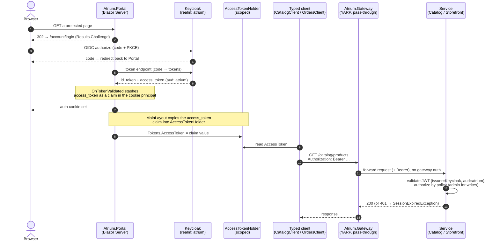

# Auth & token propagation (sequence)

How a signed-in user's access token gets from Keycloak into an outbound API call, and how the
downstream service validates it. This is the runtime picture behind
[ADR-0003](../adr/0003-yarp-keycloak-auth.md) (YARP + Keycloak) and
[ADR-0004](../adr/0004-token-propagation-and-option-b.md) (token-in-claim).

Key facts every step reflects:

- The Portal is a confidential OIDC client (`atrium-portal`) using the authorization-code + PKCE flow
  (`src/Atrium.Portal/Program.cs`).
- On `OnTokenValidated`, the raw access token is stashed as a custom `access_token` claim in the
  principal, because a Blazor **circuit** has no `HttpContext` to fetch it from later.
- `MainLayout` copies that claim into the **scoped** `AccessTokenHolder`
  (`Tokens.AccessToken = (await AuthState).User.FindFirst("access_token")?.Value`).
- The module typed clients (`CatalogClient` / `OrdersClient` / `ReportsClient`) call
  `http.SendForJsonAsync(...)`, which calls `request.Authorize(tokens)` attaching `Authorization: Bearer …`
  **only when the holder is non-empty** (`src/Atrium.Design/HttpClientExtensions.cs`). **No
  factory-registered `DelegatingHandler`** — `IHttpClientFactory` builds handler chains in a separate DI
  scope where the circuit-scoped holder is empty. Exception: the AG-UI chat client owns its `HttpClient`
  internally and has no per-request send seam; its `BearerTokenHandler` is composed in circuit scope
  instead ([ADR-0011](../adr/0011-circuit-scoped-bearer-handler.md)).
- The **gateway is a pass-through** — it does no auth of its own; it forwards the request (and its
  bearer) to the target cluster.
- Each service validates the JWT with `AddKeycloakJwtBearer(realm: "atrium", Audience = "atrium")`.

> Note: the token-in-claim shortcut carries known debt (no refresh, stale-cookie-after-restart). The
> documented exit is a server-side token store — see [ADR-0004](../adr/0004-token-propagation-and-option-b.md).
