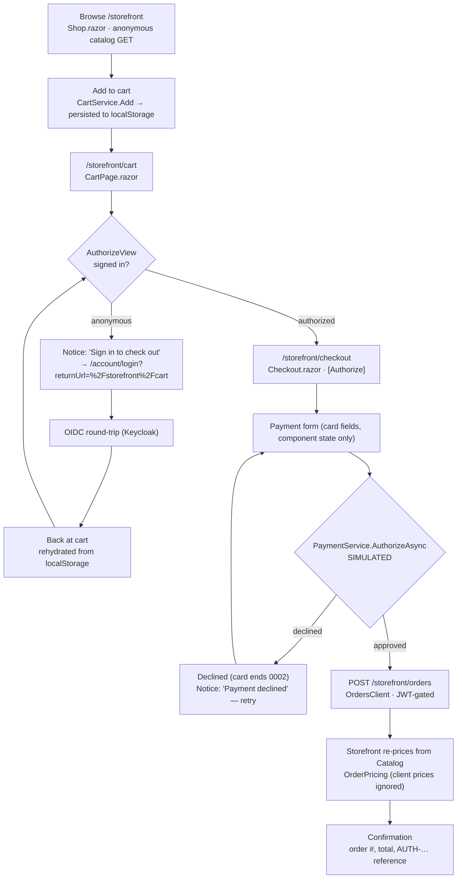

# Checkout UI flow (end-to-end)

The real storefront journey as of the checkout work: anonymous browse → cart → sign-in gate →
checkout → **simulated** payment → order placement → confirmation. Every route, guard, and service
below exists in code (`src/Atrium.Modules.Storefront/` and `src/Atrium.Services.Storefront/`).

What makes this accurate rather than aspirational:

- **Browsing is anonymous.** `Shop.razor` (`@page "/storefront"`) calls `CatalogClient`, whose
  `Authorize(tokens)` attaches a bearer **only if one exists**; the Catalog reads are
  `.AllowAnonymous()`, so a signed-out visitor sees products.
- **The cart survives sign-in.** `CartService` is circuit-scoped; `CartPersistence` mirrors a minimal
  `{ProductId, Quantity}` snapshot to `localStorage` (`wwwroot/js/cart-storage.js`) on every mutation
  and re-hydrates (re-pricing from the live catalog) on the first interactive render.
- **The gate is `<AuthorizeView>` in `CartPage.razor`** (`@page "/storefront/cart"`): anonymous users
  get a "Sign in to check out" `Notice` linking to `/account/login?returnUrl=%2Fstorefront%2Fcart`;
  signed-in users get "Proceed to checkout" → `/storefront/checkout`.
- **Checkout is `[Authorize]`** (`Checkout.razor`, `@page "/storefront/checkout"`).
- **Payment is simulated.** `PaymentService.AuthorizeAsync` does a `Task.Delay(600)` and returns
  approve/decline — no gateway, network, or SDK. A card number ending in `0002` (`DeclineSuffix`) is
  declined; anything else is approved with an `AUTH-…` reference.
- **On approval**, `OrdersClient.CreateAsync` does `POST /storefront/orders` (JWT-gated); the service
  **re-prices every line from Catalog** (`OrderPricing`) and never trusts client prices. A per-attempt
  idempotency key makes retries safe: on a same-user replay the service re-reads and returns the already-committed
  order; a cross-user key collision returns **409 Conflict** rather than leaking another user's order.

> Payment is a mock authorizer — there is **no** external payment gateway. See
> `Checkout/PaymentService.cs`. Order writes go through the YARP gateway (pass-through) to the
> Storefront vertical, which validates the JWT; route nesting under `/storefront` follows
> [ADR-0009](../adr/0009-service-root-route-nesting.md).
