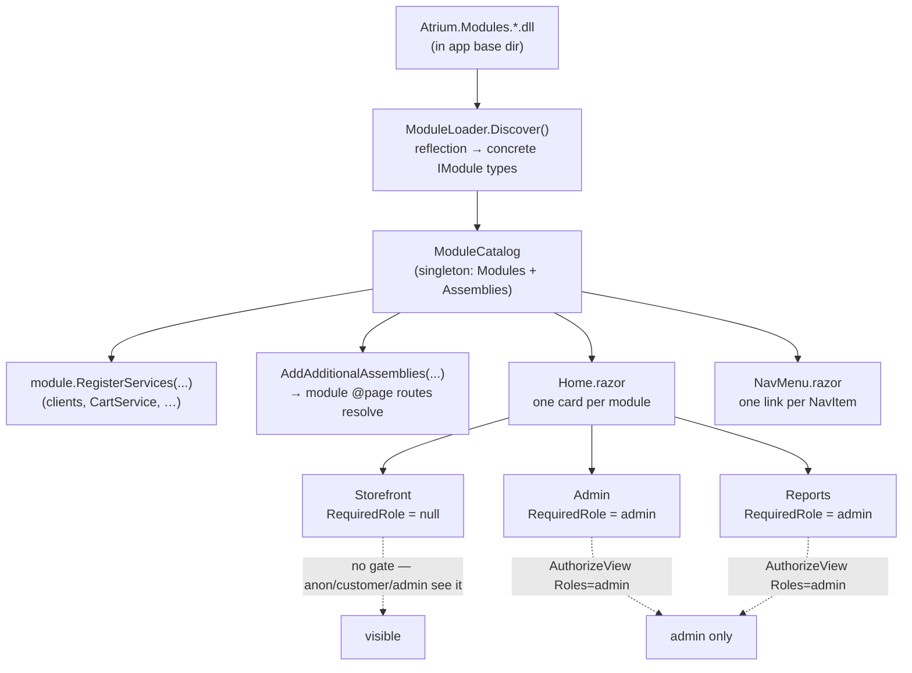

# Module discovery & role-gating

How the host turns DLLs on disk into homepage cards and nav links, and how each module is role-gated.
This is the mechanism behind [ADR-0001](../adr/0001-modular-monolith.md).

Verified against the code:

- `ModuleLoader.Discover()` enumerates `Atrium.Modules.*.dll` in `AppContext.BaseDirectory`, loads
  each assembly, finds concrete `IModule` types by reflection, and `Activator.CreateInstance`s them
  into a `ModuleCatalog` (`src/Atrium.Portal/Modularity/ModuleLoader.cs`).
- `Program.cs` calls `ModuleLoader.Discover()`, lets each module `RegisterServices(...)`, and registers
  the `ModuleCatalog` as a singleton. It also feeds the module assemblies to
  `MapRazorComponents().AddAdditionalAssemblies(...)` so module `@page` routes resolve.
- `Home.razor` renders one card per module; `NavMenu.razor` renders one nav link per `NavItem`.
- **Role-gating** is per-module `RequiredRole` (and per-`NavItem` `RequiredRole`), wrapped in
  `<AuthorizeView Roles="…">`. Actual values in code:
  - `StorefrontModule.RequiredRole` = `null` → visible to everyone (incl. anonymous/customer).
  - `AdminModule.RequiredRole` = `"admin"`.
  - `ReportsModule.RequiredRole` = `"admin"`.

Net effect: an anonymous or `customer` user sees **Storefront** only; an `admin` sees **all three**.
